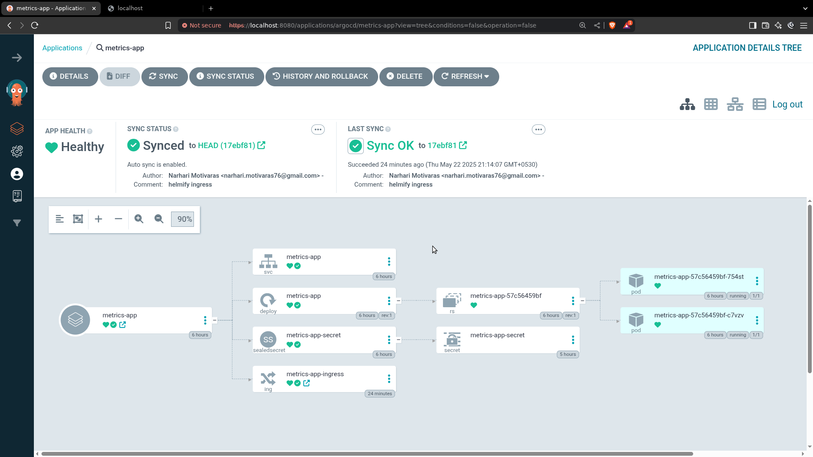

# metrics-app
## **1. Helm Chart Creation**
Installing Helm
```bash
curl https://baltocdn.com/helm/signing.asc | gpg --dearmor | sudo tee /usr/share/keyrings/helm.gpg > /dev/null
sudo apt-get install apt-transport-https --yes
echo "deb [arch=$(dpkg --print-architecture) signed-by=/usr/share/keyrings/helm.gpg] https://baltocdn.com/helm/stable/debian/ all main" | sudo tee /etc/apt/sources.list.d/helm-stable-debian.list
sudo apt-get update
sudo apt-get install helm
``` 
- Create a Helm chart named `metrics-app` using 
```bash
helm create metrics-app
```
- Below is the directory structure which will be created by helm
```bash
❯ tree -L 1
[ 18K]  ./
├── [ 349]  .helmignore
├── [1.1K]  Chart.yaml
├── [4.0K]  charts/
├── [4.0K]  templates/
└── [4.2K]  values.yaml

  18K used in 2 directories, 3 files
```
- The Docker image is hosted at: `ghcr.io/cloudraftio/metrics-app:1.4`
```yaml
#values.yaml
image:
  repository: ghcr.io/cloudraftio/metrics-app
  pullPolicy: IfNotPresent
  tag: 1.4 
```
- It runs on port `8080` and exposes a `/counter` endpoint.
- App needs a secret `PASSWORD` set to `MYPASSWORD`, available as an environment variable. Ensure it is securely passed.
 1. Install Sealed Secrets Controller
```bash
kubectl apply -f https://github.com/bitnami-labs/sealed-secrets/releases/download/v0.29.0/controller.yaml
```
2. Install Kubeseal to generate password:
```bash
kubectl apply -f https://github.com/bitnami-labs/sealed-secrets/releases/download/v0.29.0/controller.yaml
curl -OL "https://github.com/bitnami-labs/sealed-secrets/releases/download/v0.29.0/kubeseal-0.29.0-linux-amd64.tar.gz"
tar -xvzf kubeseal-0.29.0-linux-amd64.tar.gz kubeseal
sudo install -m 755 kubeseal /usr/local/bin/kubeseal

```
- Create [sealedsecret](https://github.com/bitnami-labs/sealed-secrets?tab=readme-ov-file#usage)

```bash
echo -n MYPASSWORD | kubectl create secret generic mysecret --dry-run=client --from-file=PASSWORD=/dev/stdin -o yaml > mysecret.yaml
kubeseal -f mysecret.yaml -w mysealedsecret.yaml 
```

- helmify the `mysealedsecret.yaml` and move to `templates` dir

```yaml
#values.yaml
app:
  sealedPassword: "AgBTsGsHrHOXnr616tzr/+YiqKDgjPnlHeVgZvp8xXuVxIzEHLWNRRTPOrQ5kM43LYx1vzEyi0UOQAX7LbBtAqXe5Y58oztZFrIFEuFJCd22f7I2mBHKMbGjSdwLqSISerowaNFAMCa3GE6K0uyOrcvjN4ktt7xxKT/Sna3BLMD1cXPpVMmCy/jaunvnqwo3V+c8xi+V1pHzUDqPc7IoP9g27Yz+jLdkR/Anu6Wulg4EdmpedmO9CrutBTr0li6CpDpIeRTKV0LdV9K3dClecNiFFrRTli6yt1GaRiS2KlABTo3M6dm+jyShpWKRw1oo6SDb4Rph6CfwHCDqWFD1hl0gjWM1hEnE+e7lnk1P4sbiSz76efMYaL6Y6JdKvL0SvYsCiH7PxUFM4v5cOn0CY88Elu+O6CKZ8wL+FE17iWCVHdtvNDp9lnFIEDPhpPmD3k0ePIzESFdXeYAAUqqgcUvRBDbrINrtu87GrNYDQGME30Zrxj2zaxW4ay6QwHAQC1Bv4QmdCRFtw4S35TR3lIrRrRs9EypA8DOiGo8vNqn4iwRX2KBxZz8fpFB4UKf7aitacz3Q50kLvpJtgsMZxhqfc+F3QZiXYpfcEgEmJvWHJREtXwhK1QIOcLM638bI0eLy62jGr7fPXLvPXtcESzdaJBEAMKQjDDN6NNsillxzifSle1nOiOvlkpKbBHk7fBCzKmSWripHYPOM"
```

```yaml
#templates/secrets.yaml
apiVersion: bitnami.com/v1alpha1
kind: SealedSecret
metadata:
  name: {{ include "metrics-app.fullname" . }}-secret
  labels:
    {{- include "metrics-app.labels" . | nindent 4 }}
spec:
  encryptedData:
    password: {{ .Values.app.sealedPassword | quote }}
  template:
    metadata:
      name: {{ include "metrics-app.fullname" . }}-secret
      labels:
        {{- include "metrics-app.labels" . | nindent 8 }}
    type: Opaque

```

## 2. Setting up KIND Cluster

1. Download the [Kind](https://github.com/kubernetes-sigs/kind/releases/download/v0.29.0/kind-linux-amd64) binary: 


2. Create `kind-config.yaml` to have multi node cluster for HA
```yaml
kind: Cluster
apiVersion: kind.x-k8s.io/v1alpha4
nodes:
- role: control-plane
  extraPortMappings:
  - containerPort: 80
    hostPort: 80
    protocol: TCP
  - containerPort: 443
    hostPort: 443
    protocol: TCP
```

3. Run below command to create cluster
```bash
kind create cluster --name cloudraft --config kind-config.yaml
```
4. Setting autocompletion
- Add below to `.bashrc` for autocompletion
```
source <(kubectl completion bash)
source /usr/share/bash-completion/bash_completion
complete -o default -F __start_kubectl k
```
- I like to keep aliases seperate and hence added `alias k=kubectl` in `.bash_aliases`

## 3. ArgoCD Installation
- Install ArgoCD on cluster 
  ```bash
  kubectl create namespace argocd
  kubectl apply -n argocd -f https://raw.githubusercontent.com/argoproj/argo-cd/stable/manifests/install.yaml
  ```
- Sanity check to see argocd-server is running
	- use port forward to access UI in browser at `localhost:8080`
	```bash
	kubectl port-forward svc/argocd-server -n argocd 8080:443
	```
	- Get admin password
	```
	kubectl get secret argocd-initial-admin-secret -n argocd -o jsonpath="{.data.password}" | base64 -d && echo
	```
- Configure ArgoCD to fetch Charts from private repo
 1. generate ssh key pair
```bash
ssh-keygen -t rsa -b 4096 -f argocd-ssh-key
```
2. Add the public key to your GitHub
3. Add the private key in ArgoCD UI

## **4. App Deployment**
- deploy the app using ArgoCD via the Helm chart
```yaml
apiVersion: argoproj.io/v1alpha1
kind: Application
metadata:
  name: metrics-app
  namespace: argocd
spec:
  project: default
  source:
    repoURL: git@github.com:narharim/metrics-app.git 
    targetRevision: v1.1 
    path: helm/metrics-app
    helm:
      valueFiles:
        - values.yaml
  destination:
    server: https://kubernetes.default.svc
    namespace: default
  syncPolicy:
    automated:
      selfHeal: true
      prune: true

```
## **5. Ingress Setup**

1. Install Ingress Setup
```bash
kubectl apply -f https://kind.sigs.k8s.io/examples/ingress/deploy-ingress-nginx.yaml
```
2. helmify ingress

## **6. Behaviour of Application**

* I started to hit `curl localhost/counter` gradually instead of using a script because of the note (i.e., *Note any anomalies or inconsistent or slow responses*).
* Yes, I did get slow responses as I hit the URL the second time.
* After hitting it for some more time, not just delay but my system resource utilization went up crazy.
* It was clear either there is a time delay coded in the application or some sort of high resource utilization.
* I wanted to put a limit on resources while building the first time only but didn't because of the task.
* I have kept liveness probe and readiness probe, and that's why the below status shows (2) restarts by kubelet:

```bash
❯ k get po
NAME                                                     READY   STATUS    RESTARTS       AGE
myapp-metrics-app-b85c956f-kqx7p   1/1     Running   2 (10m ago)        10h
```

* As soon as I ran the below snippets, my system load (number of processes waiting for CPU time) increased to 30+ in 1 min:

```bash
for i in $(seq 0 20)
do 
time curl localhost/counter
done
```

* My laptop got hung and I had to take a screenshot from my phone.
* 


## **7. Root Cause Analysis**
- My first instinct was as I had not put resource limits initially used by my application, it was utilizing my whole available resources.
- Checked logs using `k logs <pod-name>` but didn’t see any abnormal logs.
- Secondly, ran the docker image using `docker run -it ghcr.io/cloudraftio/metrics-app:1.4`:
```bash
❯ docker run -it ghcr.io/cloudraftio/metrics-app:1.4
 * Serving Flask app 'app'
 * Debug mode: off
WARNING: This is a development server. Do not use it in a production deployment. Use a production WSGI server instead.
 * Running on all addresses (0.0.0.0)
 * Running on http://127.0.0.1:8080
 * Running on http://172.17.0.3:8080
Press CTRL+C to quit
```

- Same behaviour was observed as mentioned above.
    
- Went inside the docker image using `docker run -it ghcr.io/cloudraftio/metrics-app:1.4` to check the code as it was written in Python.
    

## **8. Code Analysis**

1. `app.py` runs `utils.initialize_services()` this starts a background thread (idle).
    
2. Flask app starts and listens on `0.0.0.0:8080`.
    
3. Calling `/` returns "Metrics Dashboard 📈".
    
4. Calling `/counter` increments a global `counter` and asynchronously triggers `metrics.trigger_background_collection()` this calls `collector.launch_collector()` which decodes and writes a memory-hogging script to `/tmp`. It also launches it using `subprocess.Popen` and returns the updated counter value.
```bash
# cat resources.dat | base64 -d
import random
import time

# Global list to keep references to bytearrays
global_memory = []

def generate_blocks():
    while True:
        _ = 0
        for _ in range(10**6):
            _ += random.randint(1, 10)
            local_list = []
            for _ in range(5):
                ba = bytearray(100 * 1024 * 1024)
                local_list.append(ba)
            # Keep reference forever
            global_memory.extend(local_list)
        time.sleep(0.05)

if __name__ == "__main__":
    generate_blocks()
```
- The above code runs an infinite loop for 1 million iterations and accumulates random values (busy work).
- It also creates 5 bytearrays, each of size 100 MB.
- As these are stored in `local_list` and added to `global_memory`, the Python garbage collector can't free them.
    
## **9. Solutions**
1. we can limits how much resources application can use.
```yaml
resources:
  requests:
    memory: "128Mi"
    cpu: "250m"
  limits:
    memory: "512Mi"
    cpu: "500m"
```
  - This will ensure that when container crosses 512Mi memory, the kubelet will kill the container and restart it (OOMKilled)
2. If the app is under real load (real traffic) we can consider auto-scaling, but for this code auto-scaling is not ideal as you want to restrict, not scale.
3. If the app hangs due to overload adding liveness probe can help.
## **10. Additional thoughts**
- Had it been written in Go and compiled as a binary, it would be difficult to debug. One way I could think to debug a Golang binary is if the process is managed by systemd then I could use `journalctl`
- Also as an application developer I will suggest the devops team to put limits to resources in service unit of systemd. for example:
```
[Service]
MemoryMax=500M
CPUQuota=50%
```
- To make the debug process easier, we can integrate with Prometheus to track memory and Grafana to visualize it
- I have kept single node for now but can also do 2 worker and 1 control plane and add tolerations, HA
___
## **11. Additional Security**
- Coming from world of container security:
	- we can implement apparmour profile which will ensure that app can write to `/tmp` only and avoid writing to any file path in the system
	- secondly, we can restrict the process calling subprocess using seccomp, also we can restrict individual kernel calls (e.g.,`chmod` syscall)
- Above will ensure that we have reduces the attack surface of the application
____


___
## **11. Additional Exploration**
[Ingress resoure best practice](https://www.loft.sh/blog/kubernetes-nginx-ingress)
[Helm x ArgoCD](https://argo-cd.readthedocs.io/en/latest/user-guide/helm/)
____

Thanks for amazing assignment. This the first time I interacted with argocd and helm. Learnt a lot :)

